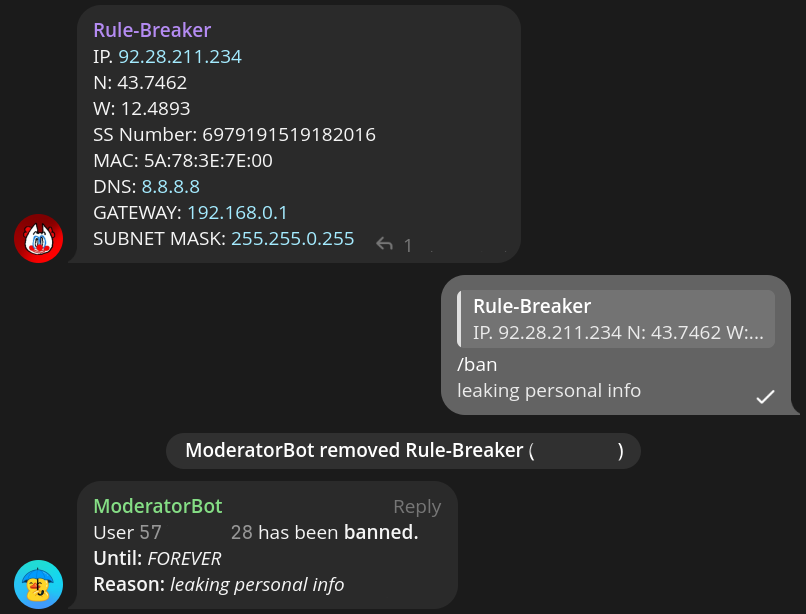

# Bot Usage Documentation

## Table of contents

1. [Command usage](#command-usage)
2. [Help command](#help-help)
3. [Mute command](#mute-mute-or-m)
4. [Unmute command](#unmute-unmute-or-um)
5. [Ban command](#ban-ban-or-b)
6. [Unban command](#unban-unban-or-ub)
7. [Kick command](#kick-kick-or-k)
8. [Warn command](#warn-warn-or-w)
9. [Unwarn command](#unwarn-unwarn-or-uw)
10. [Info command](#info-info-or-i)

## Command usage

Certain commands take in time durations as variables. For example, bans or mutes.
To handle these, ModeratorBot has a consistent way of defining time durations, explained here:

| Option | Description   |
|--------|---------------|
| **X**m | **X** minutes |
| **X**h | **X** hours   |
| **X**d | **X** days    |

You can also combine it! Example: `1d12h30m`

If you can't find user ID of a user, all moderation commands can be used with a reply to someone to extract Telegram
user ID, for example, `/mute 1234567 1d` when replying, turns into `/mute 1d`.
<br>
> [!IMPORTANT]
> Due to Telegram limitations, you can mute and ban, at max - for 365 days (whole year), at minimum - 30 seconds.
> Otherwise, the punishment in the bot will display as desired, but on the Telegram's side, the action is indefinite.

All moderation commands have an optional reason for the action taken. Reasons are typed on a second line of the message,
and displayed in the action completed message, and in the `/info`
<br>
Example:

```
/kick 1234567
Asked to be kicked.
```

Certain commands have aliases: for example, `/unwarn` can be shortened to `/uw`. To get a list of all aliases, enter
`/help`


<br>
<br>
[To the top](#bot-usage-documentation)

## Help (/help)

Help is a command that lists out all commands available in the bot.

[To the top](#bot-usage-documentation)

## Mute (/mute or /m)

Mute command silences a user.

[To the top](#bot-usage-documentation)

## Unmute (/unmute or /um)

Unmute command reverts the silencing of a user.

[To the top](#bot-usage-documentation)

## Ban (/ban or /b)

Ban command removes a user from the group and does not allow the user to join back

[To the top](#bot-usage-documentation)

## Unban (/unban or /ub)

Unban command reverts the ban.

[To the top](#bot-usage-documentation)

## Kick (/kick or /k)

Kick command removes a user from the group, but still allows the user to join back

[To the top](#bot-usage-documentation)

## Warn (/warn or /w)

Increments the counter of warnings on the user. If the counter reaches the threshold (default: 3) - the user
gets [banned](#ban-ban-or-b) (the counter gets reset too).

[To the top](#bot-usage-documentation)

## Unwarn (/unwarn or /uw)

Decrements the counter of warnings on the user.

[To the top](#bot-usage-documentation)

## Info (/info or /i)

Shows the track record of the user and some other statistics.
<br>
The info is not shown at first, but will be revealed after
pressing the button.

But after pressing, this is how it looks.


[To the top](#bot-usage-documentation)